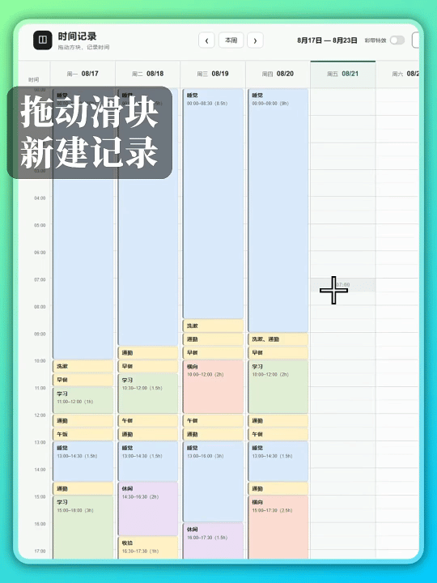

# 个人时间记录工具 · Personal Time Tracker

[](https://github.com/hrounder/personal-time-tracker/releases/latest)


一款本地优先的个人周时间记录工具。像使用 Excel 表格一样，在一周视图中拖动半小时方块记录活动，并查看每日、每周统计；数据保存在自己的电脑上，也可以导出为适合 AI 分析的结构化 JSON。

**Personal Time Tracker** is a local-first, offline weekly time-tracking app with an Excel-style grid. Drag 30-minute time blocks to log activities, review daily and weekly statistics, organize records by category, and export structured JSON for AI analysis. A portable Windows app is available.

> 【置顶】2026.9.20：软件版已更新至 v0.5.0，点击[下载 Windows 绿色版](https://github.com/hrounder/personal-time-tracker/releases/tag/v0.5.0)。

## 功能演示

拖动时间方块，快速新建一条记录：

<p align="center">
  
</p>

## 启动

**注：** 源码版需要安装 Python 3；如未安装，推荐直接下载上方的软件版启动。

Windows 用户可以双击项目顶层的 `start.bat` 启动。

请勿将 `start.bat` 直接复制到桌面，否则会因为找不到项目文件而无法启动。可以右键点击 `start.bat`，选择“发送到 → 桌面快捷方式”，通过快捷方式从桌面打开。

也可以在项目根目录运行：

```powershell
python src/server.py
```

## 项目功能

- 在 Excel 式周时间表中拖动空白时间格创建记录，拖动已有记录块快速复制。
- 单击已有记录，可编辑事项、分类、时间和备注，或直接删除。
- 在完整周视图中预览一周 24 小时的时间分布。
- 显示每日分类时长、重点事项，以及本周分类时长条形统计图。
- 自定义分类名称、颜色和排列顺序。
- 导出规则的 JSON 数据，便于交给 AI 分析或用于其他工具。
- 可选的彩带反馈特效，开关设置会被保留。
- 自动阻止记录占用同一时间段，避免重复统计。

## 数据与隐私

- 时间记录、分类和设置均保存在本机，不依赖云端账号。
- 时间记录按周拆分为 JSON 文件，便于备份、迁移和长期保存。
- 软件只监听本机地址 `127.0.0.1`，不会向局域网开放服务。

## 项目结构

```text
personal-time-tracker/
├── README.md
├── start.bat                 # Windows 源码版启动程序
├── src/                      # 页面与本地服务源码
│   ├── app.js
│   ├── index.html
│   ├── server.py
│   └── style.css
├── desktop/                  # Windows 绿色软件构建文件
├── tool/
│   └── weekly-summary/       # 每周数据整理工具
├── config/                   # 分类与用户设置
├── data/                     # 每周时间记录
└── backups/                  # 本地备份
```

## 数据整理工具

`tool/weekly-summary/` 可以将每周的时间块记录整理为按日期、分类和事项汇总的 JSON；同一分类下名称相同的事项会合并统计。

```powershell
python tool/weekly-summary/summarize_by_week.py
```

结果保存在 `data/weekly-summary/`，具体格式和参数见 [`tool/weekly-summary/README.md`](tool/weekly-summary/README.md)。

## 注意

- 不要直接双击 `src/index.html`，否则页面无法将记录写入本地 JSON 文件。
- 服务只监听 `127.0.0.1`，其他电脑无法访问。
- 不要在工具运行时手动编辑正在使用的数据文件。
- `data/`、`config/` 和 `backups/` 不会提交到 GitHub，个人记录与配置保存在本机。
